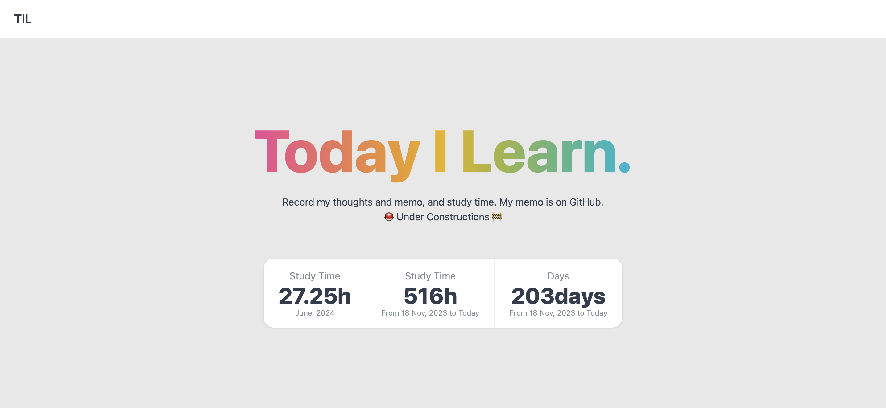

### CHECK MY TIL SITE: https://pss-aileen.github.io/TIL/

memos in https://github.com/pss-aileen/TIL/tree/main/documents

### 概要

- TIL、Today I Learn を GitHub リポジトリに書いていく文化に感化され作成したリポジトリ
- 学んだことや勉強時間を書き残している
- 2023 年 11 月 18 日から毎日勉強を開始
- 2024 年 6 月 9 日、勉強時間の合計や何にどれくらい時間をかけたか集計するために全体を Vue で制作

### 使用技術

- JavaScript
- Vue
- Tailwind CSS
- daisyUI

### 実装機能

- 勉強開始日からの日数
- 勉強時間合計
- 今月の勉強時間の合計
- 日付、勉強時間、一言メモの列挙

### これから実装したいこと

とにかく、頑張ったことを視覚化したい...！

- [ ] 日付の左に、2023/11/18 から何日目かを表示する
- [ ] 勉強したもの、プロジェクトごとのログを確認できるようにする
- [ ] 月毎のレポートをページを作る（何を何時間作業したかのログ）
- [ ] 月毎の振り返りレポートのコメント json を作る
- [ ] スマホでの見た目の調整
- [ ] 先月の勉強時間と、今月の勉強時間が何時間多いか比較（6月10日だったら、5月10日までの合計と比較）
- [ ] 勉強時間の小数点以下2桁を表示させる