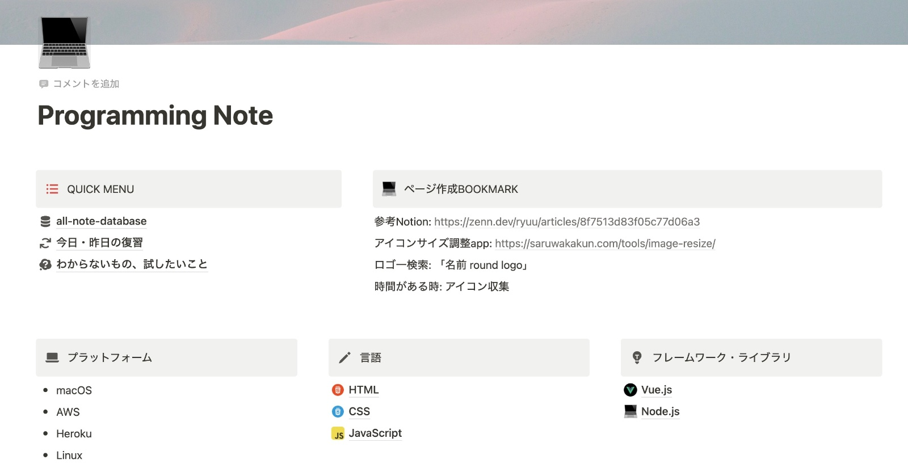
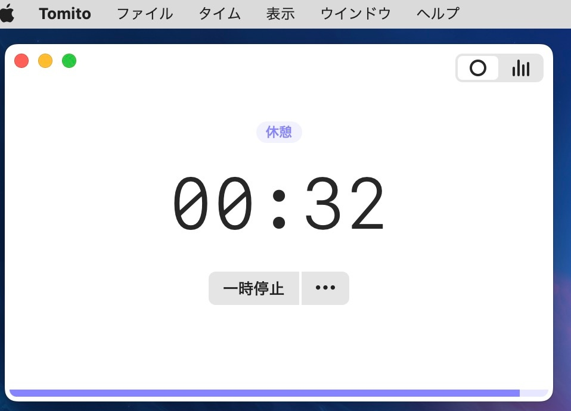
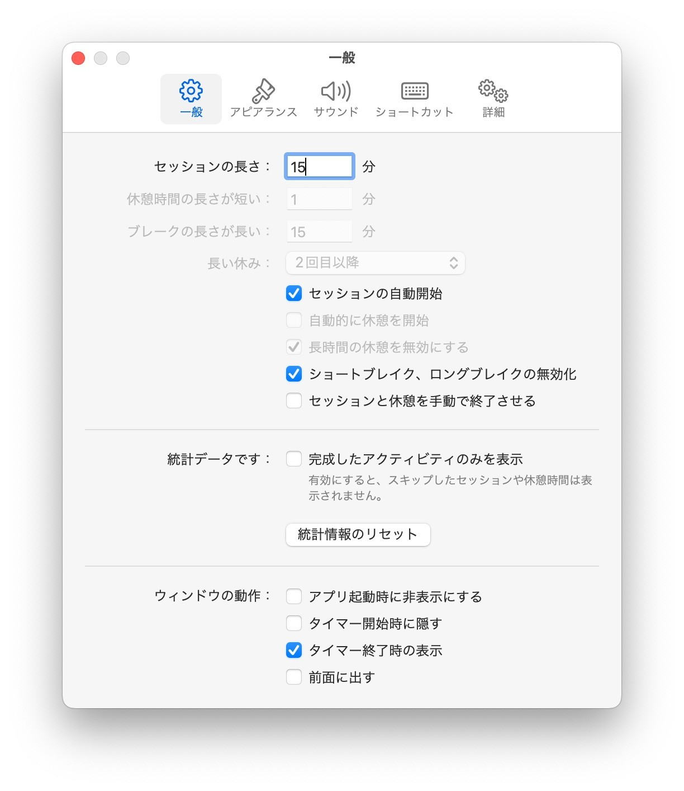
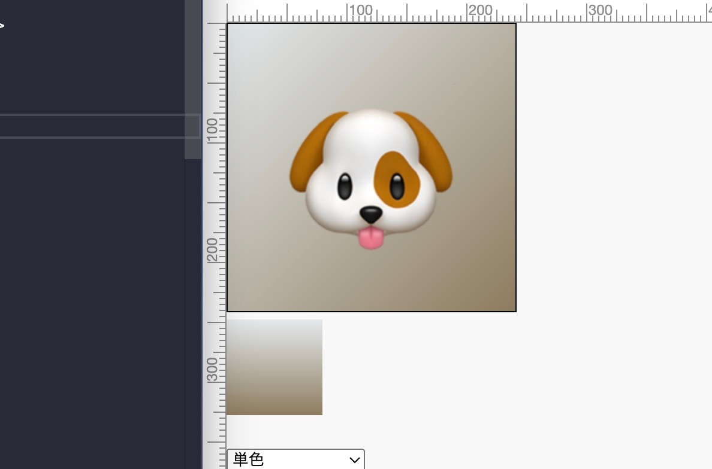
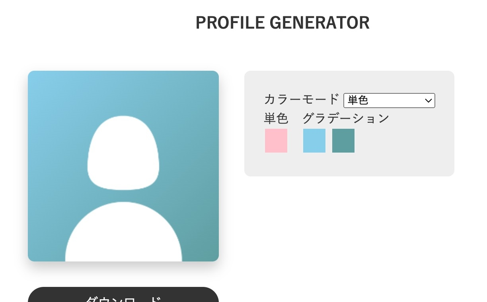

# day 001/366: 過集中, Notion, Udemy購入

## day 001/366

普段はうまくいかなくて、挫折して恥ずかしくなるのであまり宣言はしないけど、来年の2024年11月18日までにちゃんと「プログラマー」としての仕事をどうにかして得たいと思ったので、日数カウントしてみることにしました。

JavaScriptを極められる範囲で極めてみたい。そして、Three.jsとか、おもしろいWebサイト、作れたらいいなぁ。1年続けたら褒めよう。むりだったら、またその時からがんばればいい！ということにしよう。折れても立ち上がればおけ！

## 今日の作業

- Notionをプログラミングノート化
- 過集中をどう管理するかの検討、調査
- Udemy、いくつか講座を購入
- JavaScriptで学ぶWebアプリ開発の必須知識〜Node.js・Web API・Ajax・async/await〜 0%→17%

作業時間 4h/4h（基本、ポモドーロ？だけど、休憩はほぼはさまなかったり、ランダムで、タイマーまわしてる間は基本何か作業しているので、以下のポーズタイムとセッション時間は全て勉強時間として換算で！）

## Notionプログラミングノート化

自分はどうしても、ノートにメモをとらないと覚えない、単語、文章を一旦書かないと頭に入ってこない人間です。なので、勉強するときはノートをパソコンの前において作業をしていました。

でもずっとずっとずっと、プログラミングに関する知識、ノウハウはどこかにちゃんとまとめたいと思っていました。一応ブログを書いていたりはしたけどブログにのせるために綺麗に書き直すことがタイムロスでした。

なので今回おもいきって久しぶりにNotionを開いて、参考のZennを見ながら自分のプログラミングノートを作りました。

作った感想は、思ったより使いこなせそう。です。Udemyの講座の内容を自分の言葉にまとめて書いて、エラーがでたところはChatGPTに聞いて、その回答をまとめて...そうすると自分だけのWiki？データベースができあがりです。でっかいノートですね。オンラインの。続けばいいなぁ。

## 過集中対策

何かをはじめるのはものすごく億劫なのですが、はじめてしまうと気がついたら夜...みたいなことが多々あります。一人暮らしのときはそれでもよかったのですが、家庭がある状態だと家のことをしたいり、ご飯を作ったりしないと生活に支障が出てしまいます。ずーっとそれが課題で、過集中で自分のことをやりすぎてしまう OR 全く何もしないか...というか、過集中状態が続くと1週間まともに家のことができなくなるとかが当たり前で、ずっとずっと辛くて、自分で止められなくて...

一応実物のタイマーをPCの横において、過集中になってしまうかも...とか次他に作業しなくちゃいけないことがある...といった時に時間制限をして、アラームがなったら一旦意識をそらす...ということはしていました。

ですが、そうするとアラーム聞こえなくてスルーしてしまったり、自分が次何の作業するかとかも忘れたりで大変でした。

そして、今日色々調べて、ひとまず何分かおきにずっとアラームがなってくれるアプリを入れました。ポモドーロ？タイマーで、ひとまず、20分作業、10分作業としてみました。

ただ、今日早速もうアラームを無視して作業してしまっており、あまりきいていないのですが、アラームがなるたびに時計をチェックできるので、その点で助かっています。

あとは20分作業だと時間がたりないので、作業時間を伸ばそうかなとも考え中です。うまい具合になればいいなぁと思います。

## Udemy 色々購入

ブラックフライデーセールで値下げをしていたので、仕事で必要になりそうな講座をいくつか購入しました。コツコツ、できる範囲で頑張っていこうと思います。1日5分でも、コード1行でも書くこと、継続していくことが大切だとは思うので、そんな気持ちでやっていこうと思います。嫌だったら動画をさーっとぼーっと見るだけでもいいですし。頑張ります。

ねむねむ。

---

# day 002/366

## 今日の作業

- JavaScriptで学ぶWebアプリ開発の必須知識〜Node.js・Web API・Ajax・async/await〜 17%→25%
- 【Three.js入門】モダンな3Dフロントエンド技術を習得して周りのエンジニアと差をつけよう！ 0%→15%
- p5.js、Three.js、Babylon.jsについて調査
- Three.js、blenderのUdemy講座購入
- Vue.jsでポートフォリオ作る場合どうするか考えた
- 年内にしたいことの計画を立てた
- 作業時間の合計は、毎週土曜日にまとめることにする（自分、覚えておいてくれ）

## 作業時間

今、設定見て気がついたけど、休憩時間をなしにできたので、これからは活動時間が計算しやすくなりそう。15分ごとに音をならして、休むか休まないかをその時きめて動く。これ良い。

---

# day 003/366

## 今日の作業

- JavaScriptで学ぶWebアプリ開発の必須知識〜Node.js・Web API・Ajax・async/await〜 25%→28%
- 【Three.js入門】モダンな3Dフロントエンド技術を習得して周りのエンジニアと差をつけよう！ 15%→20%
- 無料のプチ講座】最新Blender3.3で３DCGデビューしよう！ 0%→60%
- ポートフォリオサイトで入れ込みたい内容を追加で考えた
- Notionのショートカットキーを調べて習得

## Blender

たぶん1年か2年ぶりにBlenderをさわりました。今までは自分のMacbookProでやっていましたが、夫が割とお高めなゲーミングPCを買っていたので、そちらでやってみました。するともーびっくり。動きがサクサク。以前はストレスに感じていた作業が苦ではなくなりそうなので、息抜き？に色々作りたいなと思いました。Blenderも良いですが、BlenderはThree.jsで動かすためにやっているので、ほどほどにコードを書いていこうと思います。

---

# day 004/366

## 今日の作業

- JavaScriptで学ぶWebアプリ開発の必須知識〜Node.js・Web API・Ajax・async/await〜 28%→33%
- 【無料のプチ講座】最新Blender3.3で３DCGデビューしよう！ 60%→100%
- 【Node.js入門】Node.jsとMongoDBを連携してTodoアプリを1から構築してみよう 0%→40%

## 2年ぶりblender

楽しかった。今ならなんだって作れる気がする。ただ、Windows置いてる机がかなり作業しにくいこともあり、腕、指が鬼筋肉痛？腱鞘炎？

## 知識詰め込みだけだとちょっと退屈

Node.jsについて学んでいたものの、インプットばかりで動かさないためちょっと退屈に感じ、Udemyで購入した、実際に作業していく動画を同時進行でやることにしてみました。完璧に理解ができているわけではないけど、同じ話が出てきて復習になったり、コードを書きながら「あの講座で言っていたあれはこれか...」と二重で確認できて、理解度を上げられて良いなと感じました。

Shin Codeさんの講座全部わかりやすくて、楽しい。

## 課題だなと思うこと

- 非同期処理（まだほぼ学べてすらいない）
- ちょっと難しめなメソッド、関数（クラス、filter、indexOfとか）を練習する機会がほしい

---

# day 005/366

## 今日の作業

- 【Node.js入門】Node.jsとMongoDBを連携してTodoアプリを1から構築してみよう 40%→59%
- JavaScriptで学ぶWebアプリ開発の必須知識〜Node.js・Web API・Ajax・async/await〜 33%→STOP Node.jsとMongoDB終わったらこちらをやっていく
- 【最初に学びたい】最新Blender3.3LTS 3DCGモデリング集中講座Part1 0%→動画をさーっと見た

今日は、夫がインフルの診断受けたり、自分もまだ咳が出たりで体調も万全でなかったけど、少し進められたのでOK。

---

# day 006/366

## 今日の作業

- これから学ぶべき内容の再調査、整理（AWS、ホスティングサービス、基本情報技術者試験など）
- Udemy必要な講座調査
- Node.js、mongoDBの繋ぎ方、ライブラリについて復習

今日は全体的に調べ物が多かったです。AWSのことを調べていると「これは私は理解できるんだろうか...」と不安になりましたが、一個一個わかることを増やすしかないなぁと思いました。

---

# day 007/366

## 今日の作業

- todoアプリ作成（Vue.js, Node.js, Express, MySQL）: Node.jsとMySQLを繋げるところまで完成✨

## todoアプリ作成

今やっているUdemyの講座を見ていたら、講座終わる前に自分でやりたくなってしまったので中断して、mongoDBではなく、MySQLを使って挑戦することにしました。うまくいくか不安でしたが、なんとなんと...Node.jsとMySQLを繋げることに成功しました。今までさっぱりだった部分が急にかちっとピースがはまった感じですごく楽しいです。気持ちい。今まで苦しんだ甲斐があった（でも苦しみたくない...笑）！

なので、Udemyの講座をちょこちょこはさみつつ、todoアプリを作り上げられたらなと思います。

---

# day 008/366

## 今日の作業

- 【JS】ガチで学びたい人のためのJavaScriptメカニズム 0→14/204
- タイピング練習（ホームポジションでタイピングしたい...）2時間ぐらい...
- 通貨換算アプリの見直し、着手（中途半端なままのものに再着手、しかし、利用していたAPIにアクセスキーが必要となり、調査が必要となった...）

## JavaScriptの基礎を頑張る

Udemy講座の進捗を%ではなく、数字にしてみました。なんか数字にするとはてしなくて...大丈夫かなと不安になりました。TodoAppはバックエンドが繋がったものの、Vueを全くかいたことがないので、CofeMafiaさんのJavaScriptの講座をやっていくことにしました。それと、JavaScirptはおおよそ理解した気ではあるんですが、オブジェクトや無名関数、定数で宣言する関数、クラスなどがあまりわかっていません。非同期処理、プロミスというものも...。JavaScriptを極めると宣言をしていたので、これらを逃げずに学んでいこうと思います。

<https://twitter.com/pss%5Faileen/status/1725705591195369718>

## タイピング

急に寿司打を思い出してやりはじめたら、ホームポジションでちゃんとタイピングしたい欲が出てきて2時間ぐらいタイピング練習をしていました。

今も頑張ってホームポジションを意識してタイピングしてるけど難しい。特に右手が難しい。この機会に少しでも改善してさらにタイピング速度を上げられたら良いなと思っています。

---

# day 009/366 time 5.8h/30h

## 今日の作業

- 寿司打
- ホームポジションのタイピング練習
- 【JS】ガチで学びたい人のためのJavaScriptメカニズム 14→29/204
- プロフィール画像生成アプリ: Canvasで生成

## プロフィール画像生成アプリ

JavaScriptの講座をしていたら何かコードをかきたい...と思い思いついていろいろチャレンジしました。Canvas前々から気になってたけど、ちょっと面倒で手を出していませんでしたが、p5.jsとかしてたのが良かったのか、案外すんなりコードを書き始められました。あと、自分では思いつけない計算をChatGPTが考えてくれるところがすごく良いです。

あとは関数の書き方、まとめかたがバラバラで結構ひどいことになっているので、勉強の復習しつつ、読みやすく、後で見てもわかるように書き換えられたらな...と思います。ミニアプリをたくさん作って力をつけたい...！

## 今日の寿司打

コツがわかった。文字をミスしなければ制限時間がのびるので、ミスせず素早く打てばかなり得点があがる。でも、ホームポジションを壊しての入力に戻ってしまうのでなんともいえない。

---

# 🗓️010/366 📚2.5h/32.5h

## 今日の作業

- 【JS】ガチで学びたい人のためのJavaScriptメカニズム 29→30/204
- 超JavaScript完全パック2023 0→3/372
- プロフィール画像生成アプリ: 関数整理、画像の埋め込み
- tomito 1.5h, without tomito 1h

## 【JS】ガチで学びたい人のためのJavaScriptメカニズムが難しすぎた

レクチャーで30まですすみましたが、早速挫折しそうです。言っていることがさっぱりで、スコープやクロージャー、即時関数...といったものを学んだのですが初見すぎてまったく頭に入りませんでした。ちょっと自分には難しいと感じたので、一旦別の超JavaScript完全パック2023に取り組んでみようと思います。もう一度基礎固めにいってみます...。

## 超JavaScript完全パック2023

まだ導入部分ですがレクチャー自体がちょっと楽しいです。VS Codeで最初からかくのではなく、Chromeのコンソールから何か入力をして、実行結果をみるといったことをしていて「えーそんなことできるの！？」といった感じです。知ってはいるものの、あまりそこで入力をすることがないので、するとそれはそれでなんだか新鮮な気持ちになりました。初学者の初学者には最適そうだなぁと今の所思っています。43時間たっぷり学べるので、頑張っていこうと思います。

## プロフィール画像生成アプリ

---

# 🗓️011/366 📚1.5h/34h

## 今日の作業

- 超JavaScript完全パック2023 3→15/372（1.5hほど、家事しながら流し見）

## 余談、掃除をがんばった

今日は朝から掃除を絶対にすると決めていたので、午前中からお昼すぎまで頑張っていました。午前中できなかった分、夕方、午後は頑張ろうと思います。（13:25メモ）

---

# 🗓️012/366 📚5.2h/39.2h

## 今日の作業

- 超JavaScript完全パック2023 9→49/372（昨日の流し見のところをコードを書いて実践、新しいところをメモしながら実践）
- ターミナルを可愛くしたくなって[starship](https://starship.rs/)をインストールしたが、見にくかったので削除...笑
- VS Codeの設定を改めて色々見直した  
   - インテリセンス、フォント、Prettierなど

## 昨日結局ずっと家事

昨日はがんばるぞーと書いておきながら、結局家事をずーっとしていて疲れ果てていました。今日は1日時間がとれるので、JavaScript、いけるところまでいきたいなと思います。目標はセクション2と3を終わらせたい...！（動画49まで...！）いけるかな？いけないかな...？→22:53できたー！お疲れ様自分！

---

# 🗓️013/366 📚5.2h/44.4h

## 今日の作業

- 超JavaScript完全パック2023 49→64/372（2時間ぐらい）  
   - 動画見つつ、メモ、手を動かす
- PROFILE IMAGE GENERATOR ひとまず完成（3時間ぐらい）  
   - <https://github.com/pss-aileen/project-profile-image-generator>

## PROFILE IMAGE GENERATOR

数日前からつくりはじめたものを一旦シンプルな機能だけにして完成させました。色々とまだ機能をつけたいなとは思うものの、形にしたかったのでひとまず形にしました。嬉しい。

## Udemyの講座のすすめかた

基礎がグラグラしてるので基礎固めと思い、ちまちまと講座をみていますが、知っていることと知らないことが交互にでてきて「つまらぬ...」と思うことが多々あり、やっぱり作りながら、わからないところは集中的に見ていく...が良いのかなと思いました。Javascriptのオブジェクトとかクラスとか複雑な関数はさっぱりなので、そのあたりを固めつつ、じゃがじゃが前に進んでいけたらなと思いました。

