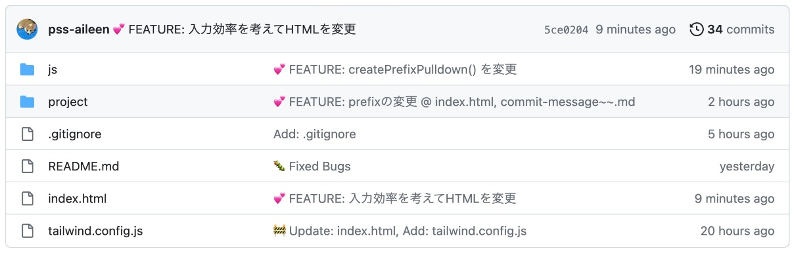
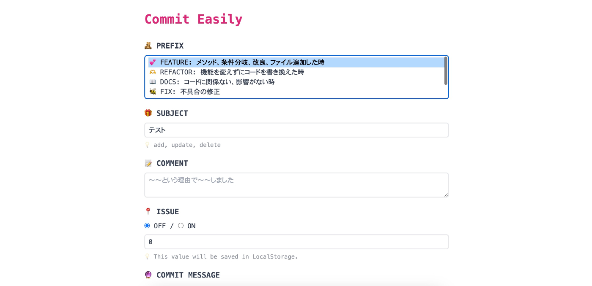

# 🗓️014/366 📚5.8h/50.2h

## 今日の作業

- 新しいプロジェクト作成、コミットメッセージジェネレーター  
   - 要件書き出し、検証、プログラム書き始め  
   - tomito以外に1hほど調査
- [Emojicode](https://www.emojicode.org/)チュートリアルをしてみる（好奇心に負けた）

## 新しいプロジェクト

自分はいろいろなことや目標やしたいことがぽんぽこ増えては消え、横にスライドしたり、戻ったりということが多々あります。JavaScriptの勉強をしていたかと思えばプロジェクトやりはじめたり...。

とりあえず、今新しく「これあったら便利だな」と思うものを作ることにしました。これを作ったら、これをあとでVueやReactで作り直せるかをやって、フロントの練習としてみようかなと思います。

---

# 🗓️015/366 📚7h/50.2h→57.2h

## 今日の作業

- Commit Easily  
   - コード書く、ひたすら書く（tomito以外で1h）
- JavaScriptのクラスについてドットインストール、YouTubeなどで調査、勉強

## （仮）Commit Easily

コミットメッセージを生成してくれるWebアプリを作成しているのですが、自分のコミットメッセージややり方がわかるようになってきました。色々なサイトを参考にしながら自分が好きなprefixを作って実際にコミットメッセージに含めて見た目を見てみたり。やっと「これでいってみよう！」ということろまで持って来れて一安心です。あとはJavaScriptをどんどん書いていきたいのですが、ちょっと複雑なロジックを作らないといけない所にくると脳がフリーズしてしまいます。紙に書き出したりはするのですが、なんかうまくいかない...。どうやったら論理的思考能力を高められるのかといつも悩んでます。とりあえず引き続き頑張っていきます。

---

# 🗓️016/366 📚4h/57.2h→61.2h

- Commit Easily: 完成！

昨日は外出したり、体調悪くなったりでけかなかったので翌日にまとめています。Commit Easilyが完成できてよかったです✨

---

# 🗓️017/366 📚2h/61.2→63.2h

## 今日の作業

- 次作るアプリをどう作るか思案

今日から週末ぐらいまで用事ががっつりはいってしまって1日30分も時間が取れない予感です。コードを最悪書けなくて良いので次作るアプリの調査だけはなんとか続けたい

---

# 018/366 💎0.75h/63.2→63.95h

## 今日の作業

- Google Spread Sheetをjson形式で書き出す方法調査、実践

今日は他の作業が立て込んでいるので余裕があればするけど、一旦上記で終了！

---

# 022/366 0.5h/63.95→64.45h

## 今日の作業

- Google Spread Sheetを自分でjson形式で書き出せるようにする  
   - 調査、コードを書いて試す

## 色々と忙しく日があいた

個人でやっているあれこれがとっても忙しく、深夜まで作業...といったことが続いていて全く手をつけれませんでした。なので今日からまたぽちぽちと頑張っていきます！

